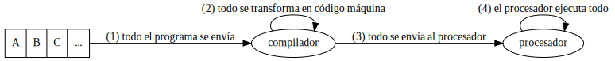

---
title: 'Tema 1: Programación de aplicaciones en HTML5'
author: Carlos León, Ismael Sagredo
date: 22/09/16
vim: spelllang=es
...

# Lenguajes interpretados

## Qué son lenguajes interpretados

Los [lenguajes
interpretados](https://en.wikipedia.org/wiki/Interpreted_language) son
lenguajes diseñados para describir programas que **no** se ejecutan en el
procesador, sino en otro programa.

Es decir, hay un programa que emula a un procesador: el **intérprete**.

{height=30%}

## Cómo funcionan


## En comparación con los compilados





## ECMAScript

ECMAScript/JavaScript es el lenguaje de los navegadores.

Comenzó como un pequeño lenguaje que se interpretaba dentro de
[Netscape](https://es.wikipedia.org/wiki/Netscape_Navigator), principalmente para incluir efectos y operaciones sencillas.

\


# JavaScript

## JavaScript

JavaScript es un dialecto de
[ECMAScript](https://es.wikipedia.org/wiki/ECMAScript).

~~~~~~~~~~~~~~~~~~~~~~~~~~{.javascript}
var variable = 6;

if(variable === 5) {
    console.log("Sí, es igual a 5.")
}
else {
    console.log("Pues no, vale " + variable + ".")
}
~~~~~~~~~~~~~~~~~~~~~~~~~~~~~~~

## JavaScript

Su sintaxis es parecida a la de C/C++/Java (intencionadamente).

Cuando JS fue creado, Java estaba muy de moda. Por eso se eligieron el nombre y
la sintaxis.

> Pero JavaScript tiene **muy poco que ver con Java**


## JavaScript en los navegadores

Casi todos los navegadores "modernos" tienen dentro una máquina virtual que
ejecuta JavaScript.

Además, tienen un API llamado DOM (*Document Object Model*) que permite acceder
a las partes del documento (por ejemplo, acceder a un párrafo o imagen de una
página web).


## JavaScript en el mundo real

JavaScript hoy en día se usa para:

- Videojuegos
- Gmail
- Google Calendar
- Facebook
- Scripting
- *Servidores*

# Ejecutando JavaScript

## Node.js

[Node.js](https://nodejs.org/) es un *intérprete* de JavaScript:

#. Recibe código JS como entrada 
#. Lo analiza (hace *parsing*) 
#. Crea una representación intermedia → ¡no lo compila!
#. Ejecuta esa representación intermedia

## Node.js como máquina virtual

Por lo tanto, `Node.js` contiene una máquina virtual capaz de leer, entender y
ejecutar JS.

Esta máquina^[una MV es sólo código, un programa que "simula" ser un ordenador] se llama [V8](https://en.wikipedia.org/wiki/V8_(JavaScript_engine)).

<p class="fragment">**V8** es el motor de [Chrome](https://www.google.com/chrome/browser/desktop/index.html).<p>

## Usando Node.js

`Node.js` se puede usar desde línea de comandos:

```bash
node script.js

# Pues no, vale 6. 
```

## Git

[Git](https://git-scm.com/) es el sistema de control de versiones que usaremos para la asignatura.

- [Guía sencilla](http://rogerdudler.github.io/git-guide/index.es.html)
- [Git in Couples](https://github.com/delapuente/gitincouples)

## Git y copias

Usar `git` no significa copiar.

Copiar sigue siendo ilegal en la asignatura


